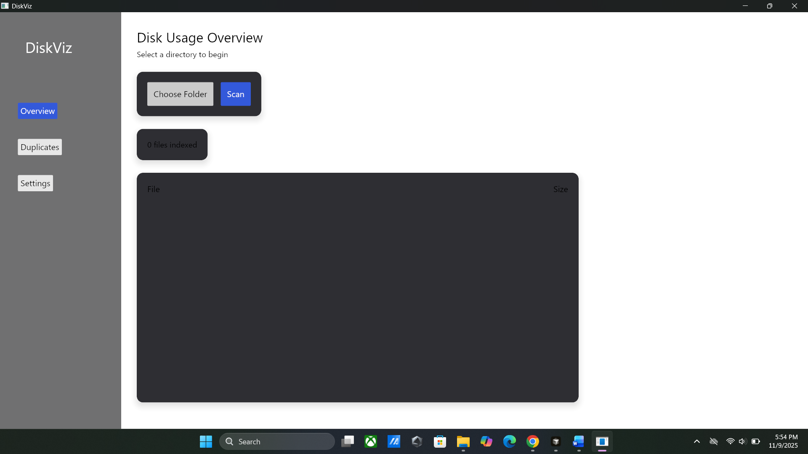
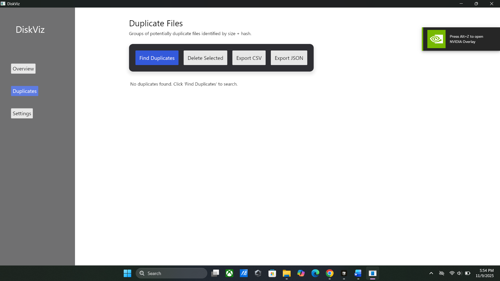
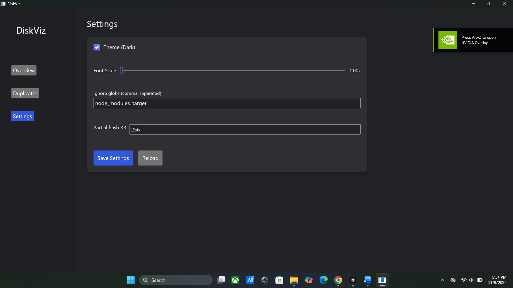

DiskViz - Disk Usage Visualizer

A modern, cross-platform desktop application for analyzing disk usage and finding duplicate files. Built with Rust and Iced GUI framework.

## Purpose

DiskViz helps you:
- **Scan directories** to understand disk usage patterns
- **Find duplicate files** using efficient multi-stage hashing
- **Safely delete duplicates** by moving files to Recycle Bin (Windows) or Trash (macOS/Linux)
- **Export results** to CSV or JSON for further analysis
- **Customize your experience** with themes, font scaling, and configuration options

## Features

### Core Functionality
- ✅ **Directory Scanning**: Recursive file system traversal with metadata collection
- ✅ **Duplicate Detection**: Three-stage algorithm (size → partial hash → full hash) using Blake3
- ✅ **Safe Deletion**: Moves files to Recycle Bin/Trash (platform-specific)
- ✅ **Export Results**: CSV and JSON export with user-selectable file locations
- ✅ **Settings Persistence**: JSON-based configuration stored in application data directory

### User Interface
- ✅ **Three-Screen Navigation**: Overview, Duplicates, Settings (sidebar navigation)
- ✅ **Light/Dark Theme**: Toggle between themes with immediate application
- ✅ **Font Scaling**: Manual text and spacing scaling (1.0x to 1.5x) for accessibility
- ✅ **Toast Notifications**: Non-intrusive feedback for user actions
- ✅ **Confirmation Dialogs**: Safety prompts before file deletion

### Advanced Features
- ✅ **Configurable Hash Size**: Adjust partial hash size for duplicate detection (default: 256 KB)
- ✅ **Ignore Patterns**: Configure glob patterns to exclude directories (settings stored, future enhancement)
- ✅ **Non-Blocking Operations**: UI remains responsive during file system operations
- ✅ **Comprehensive Logging**: Daily rolling log files for debugging

## Application Screens

### Overview Screen
The main screen for directory scanning and file listing:
- **Choose Folder**: Select a directory to scan
- **Scan**: Start scanning the selected directory
- **File Table**: Displays scanned files with path and size
- **Status**: Shows scan progress and file count



### Duplicates Screen
The screen for finding and managing duplicate files:
- **Find Duplicates**: Start duplicate detection on scanned files
- **Delete Selected**: Delete selected duplicate files (with confirmation)
- **Export CSV**: Export duplicate list to CSV format
- **Export JSON**: Export duplicate list to JSON format
- **Duplicate Groups**: Displays groups of identical files with checkboxes



### Settings Screen
Configuration and preferences:
- **Theme Toggle**: Switch between dark and light themes
- **Font Scale**: Adjust UI text size (1.0x to 1.5x)
- **Ignore Globs**: Comma-separated patterns for directory exclusion (settings stored)
- **Partial Hash KB**: Size of partial hash for duplicate detection (default: 256 KB)
- **Save Settings**: Persist settings to disk
- **Reload**: Reload settings from disk (discards unsaved changes)



## Configuration

### Settings File Location

Settings are stored in a JSON file in the application's configuration directory:

- **Windows**: `%APPDATA%\SAN\diskviz\config.json`
- **macOS**: `~/Library/Application Support/SAN/diskviz/config.json`
- **Linux**: `~/.config/SAN/diskviz/config.json`

### Log Files

Log files are stored in the application's data directory:

- **Windows**: `%LOCALAPPDATA%\SAN\diskviz\diskviz.log` (daily rolling)
- **macOS**: `~/Library/Application Support/SAN/diskviz/diskviz.log` (daily rolling)
- **Linux**: `~/.local/share/SAN/diskviz/diskviz.log` (daily rolling)

### Settings Format

The settings file (`config.json`) contains:
```json
{
  "theme_dark": true,
  "font_scale": 1.0,
  "ignore_globs": ["node_modules", "target"],
  "partial_hash_kb": 256
}
```

## Export Formats

### CSV Export
Exports duplicate files in CSV format with the following columns:
- **Group**: Group number (1, 2, 3, ...)
- **Path**: Full file path
- **Size**: File size in bytes

### JSON Export
Exports duplicate groups as a JSON array of arrays:
```json
[
  [
    {
      "path": "/path/to/file1.txt",
      "size": 1024,
      "modified": 1234567890,
      "is_dir": false
    },
    {
      "path": "/path/to/file2.txt",
      "size": 1024,
      "modified": 1234567890,
      "is_dir": false
    }
  ]
]
```

## Safety Features

### Delete Confirmation
- All file deletions require explicit confirmation
- Confirmation dialog shows the number of files to be deleted
- Files are moved to Recycle Bin/Trash (not permanently deleted)
- Deleted files can be restored from Recycle Bin/Trash

### Best Practices
1. **Review before deleting**: Always check duplicate groups before deletion
2. **Keep originals**: Consider keeping the oldest or most recently accessed file
3. **Backup important data**: Always backup critical files before bulk operations
4. **Test with small directories**: Start with small directories to understand behavior

## Project Structure

```
diskviz/
├── src/
│   ├── main.rs          # Application entry point
│   ├── app.rs           # Main application state and message handling
│   ├── core/            # Core business logic
│   │   ├── scan.rs      # Directory scanning
│   │   ├── dedupe.rs    # Duplicate detection
│   │   ├── export.rs    # CSV/JSON export
│   │   ├── trashcan.rs  # File deletion
│   │   ├── config.rs    # Settings management
│   │   ├── logging.rs   # Logging setup
│   │   └── types.rs     # Type definitions
│   └── ui/              # User interface
│       ├── overview.rs  # Overview screen
│       ├── duplicates.rs # Duplicates screen
│       ├── settings.rs  # Settings screen
│       ├── widgets.rs   # Reusable UI components
│       └── styles.rs    # Custom styles and helpers
├── Cargo.toml           # Dependencies and metadata
├── README.md            # This file
└── USER_GUIDE.md        # Detailed user guide
```

## Dependencies

### Core Dependencies
- **iced 0.12**: GUI framework with tokio executor
- **tokio 1.39**: Async runtime for non-blocking operations
- **blake3 1.5.4**: Fast cryptographic hashing
- **rayon 1.10.0**: Data parallelism for duplicate detection
- **ignore 0.4.22**: Efficient file system traversal
- **trash 5.0.0**: Platform-specific Recycle Bin/Trash integration
- **rfd 0.14**: Async file dialogs
- **humansize 2.1.3**: Human-readable file size formatting
- **serde 1.0**: Serialization/deserialization
- **directories 5.0.1**: Cross-platform directory resolution
